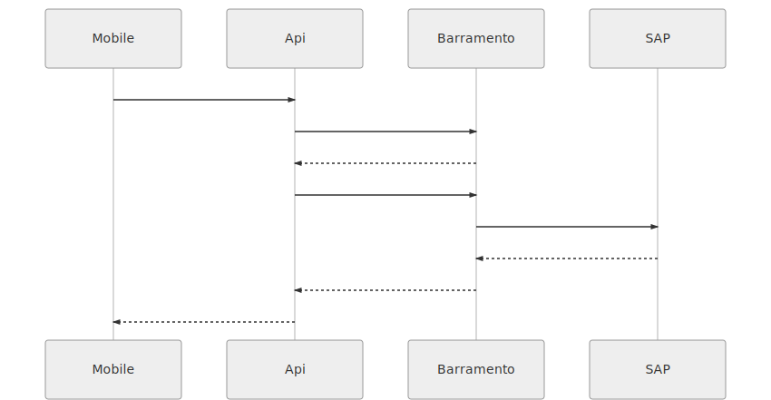
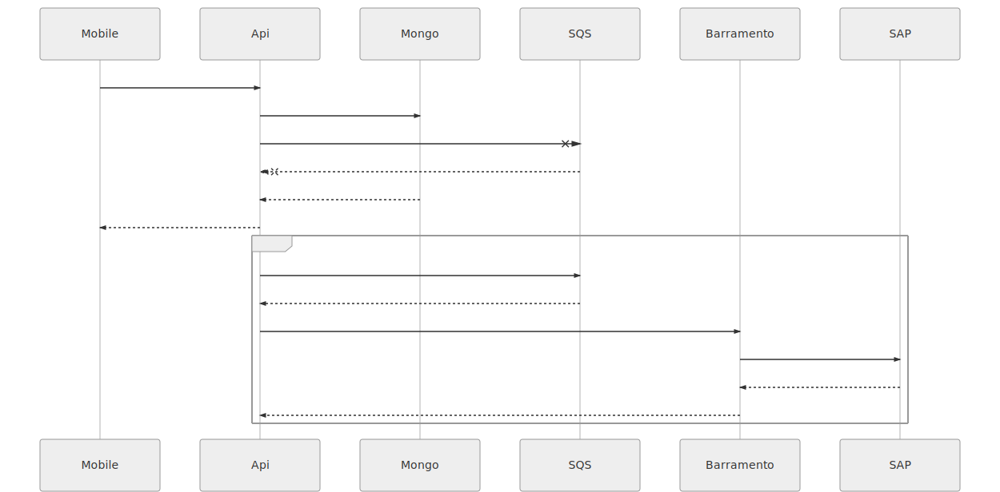

# Manutenção Industrial Apis

Estrutura e informações iniciais para o desenvolvimento das Apis do projeto manutenção industrial com integração com o SAP-PM.

## Pré-requisitos

- [NodeJS](https://nodejs.org)
- [MongoDB](https://www.mongodb.com)

## Rodando o Projeto

1. Faça o clone do projeto utilizando o  `git clone` do repositório `duratex/industrial-manutencao-api` ;
2. Na pasta do projeto execute o comando `npm install` ;
3. Entre na pasta de cada Api e  execute o comando `npm install` ;
4. Na pasta do projeto execute o comando `npm run industrial:local`.


|                |Local                        | Deploy |
|----------------|-------------------------------|-------------|
| Development | `npm run industrial:local`           | `npm run deploy:dev` |
|Stagging          |`npm run industrial:local:qa`     | `npm run deploy:qa`  |
|Production          |`npm run industrial:local:prd`  | `npm run deploy:prd` |


## Apis

- Apontamento
- Ordem
- Apr
- Auth
- Catalogos
- Instalacao
- Equipamento
- Nota
- Pontos-medicao
- Usuario
- Dados-mestre

## Estrutura da Api

A estrutura de cada  Api segue o seguinte padrão de diretórios:

```
- {nomeAPI}/
|- src/
|-- config/
|--- industrial.js
|-- functions/
|-- services/
|-- models/
|-- infrastructure/
|- serverless.yml
|- package.json
```


## Processo de comunicação

Cada Api contem uma lib de infraestrutura, composta pelos seguintes recursos de comunicação: 
 - Barramento;
 - ApiGateway:
 - Lambda;


## Fluxo Integrado
Acontece quando temos a integração completa partindo do Mobile até o SAP por meio de chamadas http.





## Fluxo Segregado
Acontece quando não temos a integração completa partindo do Mobile até o SAP,
 um exemplo simples é o login de um usuário,  carregamos a base da Api  em mongoDB por sincronização com SAP, e quando o usuário realiza o login a Api busca na base dela.

### Apontamentos
Os processos de Apontamentos são registrados por mensageria, utilizamos o serviço SQS da aws e funciona da seguinte forma: 





### Sincronismos  
Os Syncs  são  jobs que carregam a base mongoDB , segue a lista dos jobs das apis: 

#### SyncUsuarios

O sync de usuários carrega a base de dados seguindo a seguinte estrutura do SAP: 

``Unidades -> Centros de Trabalho -> Usuários ``

#### SyncCatalogos

O sync de catálogos carrega a base de dados seguindo a seguinte estrutura do SAP: 

``Unidades -> Catálogos -> Grupos de Código -> Código ``

#### SyncInstalacao

O sync de locais de instalação  carrega a base de dados seguindo a seguinte estrutura do SAP: 

``Unidades -> Locais Instalacao -> Detalhe Locais Instalacao ``

#### SyncEquipamento

O sync de equipamento é diferente dos outros syncs, ele chama os lambdas internamente pelo metodo invoke do SDK da aws. Ao chamar o Lambda  syncListaEquipamentos dividimos em blocos de no máximo 500 itens para processamento. para que o processo de execução de cada item seja completo. com isso conseguimos superar o limite de no máximo 15 min em execução do lambda.


